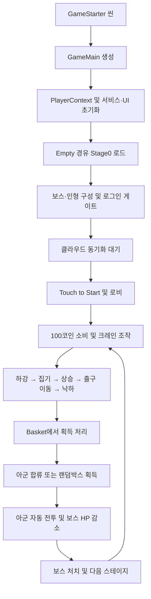

**TakePick Unity 프로젝트 분석 — 2026-09-07**

분석 대상은 `D:\pick`의 현재 작업 트리다. TakePick은 물리 기반 인형뽑기와 아군 자동 전투, 보스 처치에 따른 스테이지 진행을 결합한 모바일 게임이다. Android 결제·광고·로그인·클라우드 저장까지 구현되어 있다. 주요 개선 우선순위는 결제 지급의 중복 방지와 계정/클라우드 복원의 적용 시점 제어다.

이번 분석은 소스·설정·데이터·기존 빌드 로그를 대상으로 했다. Unity 실행, 신규 빌드, 실기기 결제 및 네트워크 장애 재현은 수행하지 않았다. 아래의 위험 항목은 코드상 근거와 발생 조건을 정리한 것이며, 실제 사용자 장애가 관측되었다는 뜻은 아니다. 기존 코드와 프리팹은 변경하지 않았다.

**프로젝트 구성**

| 항목 | 확인 내용 |
|---|---|
| Unity | 6000.3.20f1 |
| 회사 / 제품 | FunRabbit / TakePick |
| 앱 버전 | 1.0.2, Android versionCode 3 |
| Android 식별자 | com.funrabbit.pick |
| Android 최소 SDK 설정 | 25 |
| 렌더링 | URP 17.3.0, 커스텀 RenderPixelatedFeature |
| 입력 / UI | 기존 Input Manager, uGUI, TextMesh Pro, DOTween |
| 빌드 씬 | GameStarter, Stage0, Empty |
| 자체 코드 규모 | Assets/Script/FunRabbit 아래 C# 113개, 16,976줄; 주석·빈 줄·하위 Editor 코드 포함 |
| Resources 프리팹 | 79개 |
| 주요 외부 기능 | Firebase Auth/Analytics, Firestore REST 저장, LevelPlay 9.5.0, Unity IAP 5.4.1 |

근거: [ProjectVersion.txt](../ProjectSettings/ProjectVersion.txt), [ProjectSettings.asset](../ProjectSettings/ProjectSettings.asset), [manifest.json](../Packages/manifest.json), [EditorBuildSettings.asset](../ProjectSettings/EditorBuildSettings.asset).

**실행 및 플레이 흐름**

`GameMain`이 서비스와 화면을 초기화하고, `SceneLoader`가 Stage0를 연다. 물리 크레인은 `Crane`의 정수 상태 머신과 `CraneMovingControl`·`CraneTransform`으로 제어한다. `Basket`은 진입한 인형을 처리하며 다중 콜라이더에 의한 동일 인형의 중복 획득을 HashSet으로 막는다.

동물 인형은 전투 아군으로 들어가고, 랜덤박스 인형은 박스 수량을 늘린다. 황금 인형은 기본 아군 3마리를 지급하며 콤보에 따른 추가 아군이 붙는다. 일부 주석에는 과거의 ‘미션 대상이 아닌 인형은 랜덤박스 게이지로 전환’ 설명이 남아 있지만, 현재 Basket 분기는 랜덤박스 액터와 일반/황금 동물 액터를 구분한다. 코드의 실제 분기를 기준으로 해석해야 한다.

`ActorBattleSystem`은 아군 슬롯·대기열·보스 모델을 관리하고, 실제 보스 HP와 스테이지 진행은 `GameQuestManager`가 기록한다. 크레인이 플레이 중일 때 보스를 처치하면 READY 복귀까지 스테이지 전환을 미룬다. 새 보스로 넘어간 뒤 이전 공격이 뒤늦게 적용되지 않도록 보스 세대 번호도 사용한다.

근거: [GameMain.cs](../Assets/Script/FunRabbit/GameMain.cs), [Crane.cs](../Assets/Script/FunRabbit/Crane/Crane.cs), [Basket.cs](../Assets/Script/FunRabbit/Basket.cs), [ActorBattleSystem.cs](../Assets/Script/FunRabbit/Actor/ActorBattleSystem.cs), [GameQuestManager.cs](../Assets/Script/FunRabbit/GameQuestManager.cs).

**콘텐츠와 재화**

| 항목 | 현재 구현 |
|---|---|
| 스테이지 | actor.json의 36행: 기본 12종, _g 12종, _r 12종 |
| 마지막 스테이지 이후 | 36 → 25로 돌아가 하드 구간 반복 |
| 인형 생성 풀 | 현재 스테이지 직전 최대 15단계; 1·2단계는 최소 두 종류를 위해 1~2단계 풀 사용 |
| 특수 인형 | 생성 위치 수가 충분할 때 랜덤박스 1~2개와 황금 인형 1~2개 |
| 초기 코인 | 2,000, 100코인 기준 20회분 |
| 크레인 플레이 비용 | 100코인 |
| 시간 보상 | 10분 후 직접 수령하는 400코인 |
| 광고 코인 보상 | 500코인, 로컬 날짜 기준 하루 최대 10회 |
| 유료 상품 | 10,000코인 / 50,000코인, 가격은 스토어 조회 |
| 데이터 | 아이템 12개, 미션 5개, 랜덤박스 결과 8개 |
| 현지화 | 문자열 95개, 한국어·영어·일본어·태국어 필드 |

현재 스테이지 구성의 원본은 `actor.json`이다. `quest.json`은 남아 있지만 `GameQuestData.Load()`는 actor 데이터를 사용한다. 랜덤박스 Probability 합계는 64로, 퍼센트가 아닌 상대 가중치로 읽어야 한다.

초반 밸런스에서 확인할 지점은 2 → 3단계다. 보스 HP가 610 → 1,800으로 약 2.95배, 보스 공격력이 15 → 44로 약 2.93배 증가한다. 두 단계의 뽑기 풀은 모두 bear/pig다. 플레이어가 공급받는 동물 종류가 그대로인 상태에서 보스 수치가 크게 증가하므로 난이도 변곡점 후보이다. 실제 소요 횟수·이탈률은 뽑기 성공률, 콤보, 아군 대기열, 공격 주기, 아이템 사용과 플레이 로그를 함께 확인해야 하며 이 자료만으로 확정할 수 없다.

근거: [actor.json](../Assets/Resources/Table/actor.json), [GameDollCreator.cs](../Assets/Script/FunRabbit/GameDollCreator.cs), [UIHud.cs](../Assets/Script/FunRabbit/UI/HUD/UIHud.cs), [CoinGetTimer.cs](../Assets/Script/FunRabbit/UI/CoinGetTimer.cs), [ShopCatalog.cs](../Assets/Script/FunRabbit/Shop/ShopCatalog.cs).

**저장 및 서비스 구조**

로컬 진행은 `PlayerPrefs`에 저장한다. `PlayerContext`가 재화와 일부 진행 값을 메모리에 보관하고 UI에 변경을 통지한다. `CloudSaveSnapshot`은 지정된 키들을 모아 JSON을 만들고, `CloudSaveManager`는 Firebase ID 토큰으로 Firestore의 사용자별 문서를 읽고 쓴다. 변경분 자동 업로드 간격은 실제 상수 기준 60초이며, 파일 상단의 10초 설명은 오래된 주석이다.

클라우드 updatedAt과 로컬 동기화 마커가 같으면 로컬을 유지하고, 다르면 클라우드를 적용한다. 새 문서라면 로컬 데이터를 업로드한다. 자동 저장은 초기 동기화 성공 후 활성화된다. 계정별 로컬 저장 공간을 분리한 구조는 아니며, 사용자 계정이 바뀔 때 동일한 로컬 저장 키를 다시 채운다.

UI는 `UIOptionAttribute`로 Resources 경로·레이어·열기 방식을 선언하고 `UIManager`가 생성/종료한다. 닫기 경로는 오브젝트를 Destroy하며, `isPool` 선언만으로 화면 풀링이 구현되었다고 볼 수 없다. 자체 게임 코드에는 asmdef 분리가 없고, 상태 접근은 싱글턴·정적 클래스·이벤트를 중심으로 연결되어 있다.

**우선 확인할 문제**

| 우선순위 | 문제와 발생 조건 | 근거 |
|---|---|---|
| 높음 | **결제 주문 재전달 시 중복 지급 위험.** OnPurchasePending에서 코인을 로컬 저장한 다음 ConfirmPurchase를 호출한다. 지급 후 확정 전 종료·확정 실패가 발생하고 같은 주문이 다시 전달되면 다시 지급한다. 처리한 거래 ID 기록과 중복 검사 경로가 없다. | AndroidShopStore.cs:161, 175–176 / ShopManager.cs:183–186 |
| 높음 | **게임 진입 후 늦은 클라우드 복원 적용.** UILoading은 12초 후 동기화 대기를 끝내지만 CloudSaveManager의 코루틴은 취소하지 않는다. 토큰 발급 지연 등으로 복원이 늦게 끝나면 플레이를 시작한 후에도 PlayerPrefs 교체·아군 정리·인형 재생성이 실행될 수 있다. | UILoading.cs:283–297 / CloudSaveManager.cs:118–150, 215–256 |
| 높음 | **계정 전환 완료 통지가 저장 복원 완료보다 빠름.** 기존 Google 계정으로 전환 시 ResyncAfterAccountSwitch를 시작한 즉시 성공 콜백을 보낸다. 상점은 구매 확인 흐름을 재개한다. 새 계정의 클라우드 적용 전에 지급된 코인이 뒤늦은 스냅샷 적용으로 사라질 수 있으므로, 전환 중 구매/게임 진행 및 지급의 순서를 검증해야 한다. | FireBaseAuthManager.cs:237–242 / CloudSaveManager.cs:269–271 / ShopManager.cs:147–166 |
| 중간 | **씬 로드 여부 검사 오류.** _curSceneName은 빈 문자열로 시작하고 갱신되지 않는다. IsLoadedScene은 전달받은 sceneName을 이 빈 값으로 덮어써 조회한다. 동일 씬 재로드 차단이 정상 동작하지 않는다. 현재 시작 시 한 번 호출되는 경로보다 재로드 기능에서 영향이 커진다. | SceneLoader.cs:10, 56–63 |
| 중간 | **최초 분석 이벤트 누락.** LogEventOnce가 ‘기록 완료’ 키를 먼저 저장한 뒤 LogEvent를 호출한다. SDK 미준비이면 LogEvent가 반환하지만 완료 키는 남으므로 이후 재시도도 생략된다. touch_start, click_enter_stage, click_play 퍼널 집계가 영향을 받을 수 있다. | FireBaseAnalyticsManager.cs:37–58 |
| 낮음·확장 시 | **재화 정수 범위 불일치.** 메모리/API는 long이지만 저장은 (int) 캐스팅이다. 2,147,483,647을 넘으면 재실행 후 수량이 달라질 수 있다. 클라우드 IntEntry도 int여서 저장 형식과 함께 정리해야 한다. 현재 상품 규모에서 즉시 한계에 닿는 문제는 아니다. | PlayerContext.cs:56–60 / CloudSaveSnapshot.cs:13 |

위 문제의 수정 방향은 거래별 지급 기록, 동기화 작업의 취소/세대 확인, 계정 복원 완료까지 진행과 구매를 제어하는 단일 완료 조건, 씬 조회 인자 수정, SDK에 이벤트를 넘길 수 있을 때 완료 마커 기록이다. 재화 지급 기록과 잔액 변경은 함께 보존되어야 하며 마커 하나만 별도로 추가하면 중간 종료 시 누락 문제가 남는다.

추가로 iOS 결제는 명시적인 미구현 스텁이다. `IosShopStore.IsReady`는 항상 false이고 Purchase는 NotSupported를 반환한다. Android 구현이 있다는 이유로 iOS 구매까지 준비된 것으로 판단하면 안 된다. [IosShopStore.cs](../Assets/Script/FunRabbit/Shop/IosShopStore.cs)

**성능·유지보수 관점**

- 인형 생성은 Resources.LoadAsync를 위치별로 순차 요청하고 Instantiate한다. 재생성에 걸리는 시간과 물리 활성 오브젝트 수를 실기기에서 측정할 지점이다. 비동기 생성 완료 전에 GameMain의 IsStageLoaded가 true가 되므로 이 플래그는 인형 생성 완료까지 보장하지 않는다.
- PlayerPrefs.Save가 재화 변경과 보스 피격 등 자주 발생하는 경로에 있다. 코인 비행 연출도 분할 지급한다. 저장 비용과 프레임 영향을 측정한 뒤 저장 경계를 조정할 수 있다.
- 앱 pause/quit의 클라우드 플러시는 메인 스레드에서 Thread.Sleep을 반복하며 최대 2초 기다린다. 앱 전환 지연 및 실제 업로드 완료 여부를 기기에서 확인할 필요가 있다.
- Singleton.OnDestroy는 일반 파괴에도 applicationIsQuitting=true를 설정한다. 관리자를 재생성하는 기능을 추가하면 종료 상태와 일반 파괴를 분리해야 한다.
- 자체 자동 테스트용 asmdef와 명확한 테스트 스위트는 확인하지 못했다. TestCrane 등의 수동 테스트 코드와 외부 패키지 예제는 있다. 결제 재전달, 계정 전환, 동기화 지연을 우선 회귀 검증 대상으로 삼는 것이 적절하다.

**검증 결과와 해석 범위**

- Table 아래 JSON 6개가 모두 파싱되었다.
- actor 36행의 stage가 1~36으로 연속이며, 각 model 프리팹과 nameKey 문자열이 존재했다.
- stringData에 중복 key가 없었다. 이 검사는 번역 품질이나 화면 표시 품질까지 검증한 것은 아니다.
- 랜덤박스의 모든 itemkey가 item.json에 존재했다.
- `build/apk_build_log_claude.txt`에 2026-09-01 APK 빌드 성공과 에러 0이 기록되어 있다. 2026-08-29 AAB 성공 로그도 존재한다.
- `build/pick_2609071724.apk` 파일이 존재하며 크기는 129,960,636바이트, 약 124MiB다. 파일 존재만으로 현재 작업 트리의 빌드 성공이나 기능 정상 동작을 보장하지는 않는다.
- 루트 build_log.txt에는 2026-07-21 LevelPlay 관련 Java 컴파일 실패가 남아 있다. 이후 성공 로그가 있어 이를 현재의 빌드 장애로 판정하지 않았다.
- 분석 시작 시 이미 stringData.json, UILoading.prefab, FireBaseAuthManager.cs, ShopManager.cs에 미커밋 변경이 있었다. 이번 분석에는 해당 변경 내용이 포함된다.

후속 작업은 결제·저장 문제의 조건 재현과 수정부터 진행하고, 그 다음 초반 2→3단계 난이도와 실기기 프레임/로딩 시간을 검증하는 순서가 적절하다.
