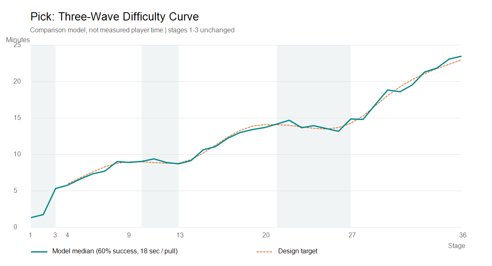

# Pick 난이도 곡선 변경 (2026-09-12)

## 적용 범위
- 사용자 확인대로 1~3스테이지의 모든 actor 테이블 값, 500코인 클리어 보상, 기존 미션 추첨 방식을 유지했다.
- 4~36스테이지의 보스 HP, 공격력, 공격 간격, 클리어 코인 보상만 조정했다.
- 전체 아군 능력치, 동물 종류, 모델, 텍스처, 뽑기 풀, 콤보, 황금 인형, mission.json은 변경하지 않았다.
- 36 클리어 후 25로 돌아가는 기존 반복 구조도 유지했다.

## 곡선
이미지의 '상승 - 휴식 - 상승 - 휴식 - 상승' 형태를 스테이지별 플레이 시간 목표로 해석했다.
보스 HP 자체를 같은 모양으로 그리지 않은 이유는 스테이지마다 뽑을 수 있는 아군의 공격력과 생존력이 달라지기 때문이다.

| 구간 | 역할 | 모델 기준 목표 |
| --- | --- | --- |
| 1~3 | 기존 초반 구간 | 변경 없음 |
| 4~9 | 첫 상승 | 약 6분 -> 9분 |
| 10~13 | 첫 휴식 | 약 9분 -> 8.8분 |
| 14~20 | 두 번째 상승 | 약 9.3분 -> 14.1분 |
| 21~27 | 두 번째 휴식 및 다음 상승 준비 | 약 14분 전후 |
| 28~36 | 마지막 상승 | 약 15.3분 -> 23분 |

13, 25에서 종족별 HP 배율이 초기화되던 현상을 제거했다. 뒤로 갈수록 시간이 필요하지만 아군이 너무 빨리 죽는 답답함을 줄이기 위해, 보스 공격력은 뽑기 풀의 평균 아군 HP를 기준으로 계산했다. 평균 아군의 집중 피격 생존 시간은 연속값 기준 약 12초가 되도록 잡았다. 실제 전투는 타격 횟수, 대기열, 콤보, 황금 인형에 따라 달라진다.

## 재미 보완
- 클리어 보상: 기존 전 구간 500코인에서 후반 최대 2,000코인까지 증가.
- 상승 구간 끝인 9, 20, 36은 해당 구간 기본 보상에 300코인 추가: 각각 1,000 / 1,400 / 2,000코인.
- 4스테이지부터 연속된 동물 미션에서 직전과 같은 대상이 바로 다시 나오지 않도록 했다. 기존 최근 6단계 후보 범위 안에서 나머지를 균등 추첨한다.
- 동물 미션 사이에 랜덤박스 미션이 끼면 이전 동물 대상까지 기억하지는 않는다.
- 이미 진행 중인 미션, 목표 수량, 추첨 가중치, 미션 보상은 그대로 유지한다.

## 저장 호환성
- 보스 남은 HP와 함께 당시 최대 HP인 bossHpMax를 저장하고 클라우드에도 포함한다.
- 기존 저장에 bossHpMax가 없으면 변경 직전의 36단계 최대 HP 표를 기준으로 변환한다.
- 남은 비율을 보존하며 정수 반올림은 올림을 사용한다. 0 HP는 계속 0이고, 살아 있는 보스가 내림 오차로 즉시 클리어되지 않는다.
- 클라우드 복원 때 스테이지 초기화가 HP 기준을 덮어쓰는 부분도 처리했다.
- 미래의 HP 변경도 저장된 최대 HP를 기준으로 한 번만 변환한다.
- 이번 작업 중 실제 플레이어 저장을 초기화하거나 진행 스테이지를 변경하지 않았다.

## 검증 결과
- Unity 컴파일 완료, 검증 후 콘솔 오류 0건.
- 새 난이도 테스트 15개 통과: 초반 전체 행 보존, 아군 및 외형 보존, 보상 범위, 구형 HP 표, 비율 변환, 0 HP, 정수 경계, 클라우드 호환성, 미션 후보 추첨.
- 기존 안전성 11개 + 출시 준비 20개 + 플레이 계측 13개 통과. 합계 59개.
- 실제 결제, 광고, Firebase 전송 없이 편집기에서 검증했다.
- 36스테이지 x 성공률 3종 x 300회 = 32,400회 비교 모델 검증. 별도 보정용 9,900회, 시작 아군 조건 600회.
- 1~3행은 변경 전과 구조적으로 동일하며, 나머지 행도 허용한 보스 3개 필드와 보상 외에는 동일함을 별도 확인했다.

| 스테이지 | HP 변경 전 -> 후 | 성공률 60% 모델 중앙값 | 중앙 뽑기 횟수 | 클리어 코인 |
| --- | --- | --- | --- | --- |
| 4 | 2,200 -> 2,950 | 5.81분 | 19 | 500 |
| 9 | 6,200 -> 9,700 | 8.92분 | 29 | 1,000 |
| 13 | 820 -> 16,550 | 8.73분 | 29 | 700 |
| 20 | 9,700 -> 31,250 | 13.71분 | 45 | 1,400 |
| 25 | 1,230 -> 55,700 | 13.57분 | 45 | 1,000 |
| 36 | 29,850 -> 139,900 | 23.50분 | 78 | 2,000 |

13과 25는 강한 아군 두 마리를 데리고 시작하는 추가 모델에서도 각각 6.19분 / 11.73분 중앙값이었다. 다만 실제 누적 대기열 전체를 이어가는 캠페인 검증은 아니다.

## 해석 및 실플레이 확인
이 시간은 실측 플레이 시간이 아니라 조정용 비교 모델이다. 18초마다 한 번 뽑고, 성공 시 물체 하나를 얻으며, 각 스테이지의 아군/대기열/콤보를 비운 상태에서 비교했다.
두 아군 슬롯, 타격 지연, 아군 사망과 이동 지연, 실제 풀 범위, 콤보, 황금 인형, 현재 미션 가중치와 동물 미션 보상을 반영했다.
코인 부족 대기, 광고, 타이머, 랜덤박스 개봉 보상, 여러 개 동시 획득, 물체 배치/소진, 의도적 목표 선택, 실시간 물리, 이전 스테이지의 누적 대기열은 반영하지 않았다.
따라서 곡선의 경향을 보기 위한 수치이며 출시 지표나 실제 유저의 클리어 시간을 보장하지 않는다.

특히 36단계는 성공률 40% 모델에서 중앙값 47.85분, 80%에서 16.22분이다. 실패가 잦은 유저는 후반이 매우 길어질 수 있다. 소프트 런칭에서 기존 승인된 뽑기 계측으로 성공률과 코인 잔액/사용량을 함께 보며 조정해야 한다.
이번에는 사용자 요청대로 후반 시간 증가를 유지했고 자동 승리나 강제 광고, 새 재화를 추가하지 않았다.
실기기에서 8~14, 19~28, 35~36 및 36->25 전환을 기존 아군과 대기열을 이어서 플레이하는 확인이 남아 있다.

## 재현
- 모델 실행: `node _report/2026-09-12_wave_balance_model.js`
- 모델은 변경 전 스냅샷을 입력으로 후보표와 CSV를 생성하며 실제 actor.json을 덮어쓰지 않는다.
- 전체 수치: `2026-09-12_wave_balance_scenarios.csv`
- 변경 전 데이터: `2026-09-12_wave_balance_before.json`
- 적용 후보 데이터: `2026-09-12_wave_balance_candidate.json`
- Unity 테스트: `Tools/Gameplay Balance/Run wave balance checks`
